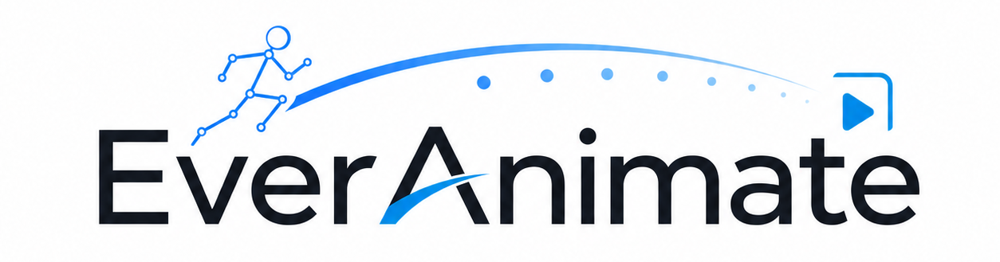
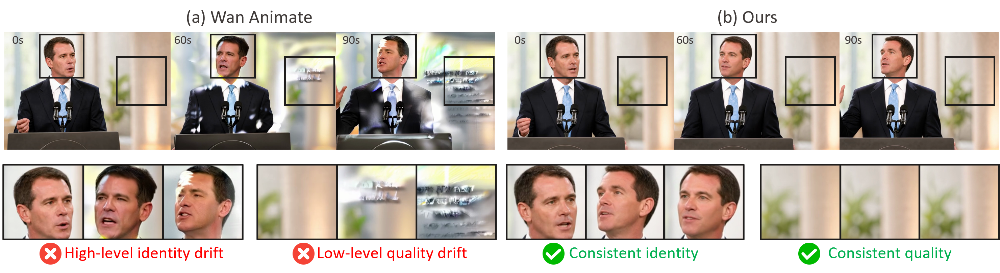

<div align="center">
  

  <h1>Minute-Scale Human Animation via Latent Flow Restoration</h1>

  <p>
    <a href="https://wymancv.github.io/wuyang.github.io/"><strong>Wuyang Li</strong></a> &nbsp;
    <a href="https://scholar.google.com/citations?user=rpT0Q6AAAAAJ&hl=en"><strong>Yang Gao</strong></a> &nbsp;
    <a href="https://people.epfl.ch/mariam.hassan?lang=en"><strong>Mariam Hassan</strong></a> &nbsp;
    <a href="https://alan-lanfeng.github.io/"><strong>Lan Feng</strong></a><br>
    <a href="https://scholar.google.com/citations?user=sHKkAToAAAAJ&hl=zh-CN"><strong>Wentao Pan</strong></a> &nbsp;
    <a href="https://scholar.google.com/citations?user=Y2Oth4MAAAAJ&hl=zh-TW"><strong>Po-Chien Luan</strong></a> &nbsp;
    <a href="https://people.epfl.ch/alexandre.alahi/?lang=en"><strong>Alexandre Alahi</strong></a><br>
    <a href="https://www.epfl.ch/labs/vita/"><em>VITA@EPFL</em></a>
  </p>

  <p>
    <a href="https://everanimate.github.io/homepage/">
      
    </a>
    <a href="https://arxiv.org/abs/2605.15042">
      
    </a>
    <a href="https://huggingface.co/epfl-vita/everanimate">
      
    </a>
    <a href="LICENSE">
      
    </a>
  </p>

  <p>
    
    
    
    
  </p>
</div>

---


Contact: <a href="https://wymancv.github.io/wuyang.github.io/"><strong>Wuyang Li</strong></a>   
Email: wymanbest@outlook.com

## ✨ Highlights

- **GPU-friendly training.** Rank-32 LoRA post-training on Wan2.2-Animate reaches strong results with thousand-level iterations on 4 GPUs.
- **Long-horizon animation.** EverAnimate supports minute-scale human animation with controlled identity and motion consistency.
- **Fully open source.** Code, training/inference scripts, LoRA checkpoints, demo data, and ablation videos are released for reproducible research.


**Note.** EverAnimate builds on the long-video generation framework of SVI 2.0 Pro. Unlike the version described in our paper, which uses a rank of 128, we reproduce and release a lighter, more user-friendly LoRA (rank 32) version focused on long-horizon human animation. It comes with ready-to-run training and inference scripts and can be used on 80GB GPUs without DeepSpeed ZeRO-2 or ZeRO-3.

If you find EverAnimate useful for your research or applications, we would greatly appreciate a ⭐.

## 📰 News

- **27 May 2026:** Code released.
- **14 May 2026:** Paper released.

## 🛠️ Environment Setup


```bash
git clone https://github.com/vita-epfl/EverAnimate.git
cd EverAnimate

conda create -n everanimate python=3.10 -y
conda activate everanimate

pip install --upgrade pip setuptools wheel packaging ninja
pip install torch torchvision --index-url https://download.pytorch.org/whl/cu121
pip install -e .
pip install flash-attn --no-build-isolation
```

## 📦 Download Models

Download all required files with one command:

```bash
bash scripts/download_models.sh
```

This downloads:

- Wan2.2-Animate diffusion, T5 encoder, VAE, and CLIP model files
- The `google/umt5-xxl` tokenizer required by the DiffSynth Wan pipeline
- The Wav2Vec processor files used by the training pipeline defaults
- EverAnimate 480p LoRA checkpoints under `ckpts/everanimate-v1-lora32`
- Demo assets from [`data`](https://huggingface.co/epfl-vita/everanimate/tree/main/data), including the minimal training sample, inference demo, and Stage-1/Stage-2 ablation videos

After downloading, the default scripts use the local `ckpts/` folder for both base models and EverAnimate LoRA checkpoints. For offline runs, set:

```bash
export DIFFSYNTH_MODEL_BASE_PATH=$PWD/ckpts
export DIFFSYNTH_SKIP_DOWNLOAD=True
```

Expected layout:

```text
ckpts/
|-- Wan-AI/Wan2.2-Animate-14B/
|   |-- diffusion_pytorch_model*.safetensors
|   |-- models_t5_umt5-xxl-enc-bf16.pth
|   |-- Wan2.1_VAE.pth
|   `-- models_clip_open-clip-xlm-roberta-large-vit-huge-14.pth
|-- Wan-AI/Wan2.1-T2V-1.3B/
|   `-- google/umt5-xxl/      # Tokenizer used by DiffSynth
|-- Wan-AI/Wan2.2-S2V-14B/
|   `-- wav2vec2-large-xlsr-53-english/
|-- everanimate-v1-lora32/
|   |-- stage1_480p.safetensors
|   `-- stage2_480p.safetensors
data/
|-- train/       # Minimal training sample
|-- test/        # Inference demo
`-- ablation/    # Stage-1 and Stage-2 ablation videos
```

The ablation videos are the two-stage outputs: `data/ablation/stage1.mp4` is the Stage-1 result, and `data/ablation/stage2.mp4` is the Stage-2 result.

EverAnimate follows the official DiffSynth-Studio model-loading convention:

- [DiffSynth model inference and loading](https://diffsynth-studio-doc.readthedocs.io/zh-cn/latest/Pipeline_Usage/Model_Inference.html)
- [DiffSynth Wan model details](https://diffsynth-studio-doc.readthedocs.io/en/latest/Model_Details/Wan.html)

## 🎬 Inference

Run the bundled test demo:

```bash
bash test.sh
```

During inference, EverAnimate automatically saves the latest chunk latents so long videos can be resumed from the saved state.

Run a longer demo with 20 chunks:

```bash
NUM_CLIPS=20 OUTPUT_PATH=outputs/test/demo_000001_20chunks.mp4 bash test.sh
```

Use custom inputs:

```bash
INPUT_IMAGE=path/to/image.png \
POSE_VIDEO=path/to/pose.mp4 \
FACE_VIDEO=path/to/face.mp4 \
OUTPUT_PATH=outputs/custom.mp4 \
bash test.sh
```

## 🚀 Training

The repository includes a minimal toy training sample under `data/train/`. Note that you need the chunk longer than 160 frames for training.

Stage 1: Conduct video extension with last latent and memory without anti-drifting. (`data/ablation/stage1.mp4`)

```bash
bash train_stage1.sh
```

Stage 2: Conduct restorative flow matching. (`data/ablation/stage2.mp4`)

```bash
bash train_stage2.sh
```

Use custom training data:

```bash
DATASET_BASE_PATH=path/to/data \
DATASET_METADATA_PATH=path/to/metadata.csv \
OUTPUT_PATH=experiments/stage1_custom \
bash train_stage1.sh
```

For Stage 2, the default Stage-1 LoRA is `ckpts/everanimate-v1-lora32/stage1_480p.safetensors`. To use another checkpoint:

```bash
LORA_CHECKPOINT=path/to/stage1.safetensors \
OUTPUT_PATH=experiments/stage2_custom \
bash train_stage2.sh
```

## 📁 Repository Layout

```text
EverAnimate/
|-- diffsynth/              # Core model, pipeline, diffusion, and utility code
|-- examples/wanvideo/      # EverAnimate SVI training examples
|-- scripts/                # Download and inference utilities
|-- data/train/             # Minimal toy training sample
|-- data/test/              # Minimal inference demo sample
|-- ckpts/Wan-AI/           # Wan base model files used by DiffSynth
|-- ckpts/everanimate-v1-lora32/ # EverAnimate 480p LoRA checkpoints
|-- train_stage1.sh
|-- train_stage2.sh
`-- test.sh
```

## 🗓️ TODO

- Release the 720p LoRA checkpoints after fine-tuning and testing are complete.

## ❓ FAQ

**Q: Why is the released model 480p?**

Due to compute constraints, the current public release provides 480p LoRA checkpoints. The 720p model is still under fine-tuning and testing, and we plan to release it in a future update. The current 480p model can also support 720p inference to some extent.

**Q: How are anchor frames used?**

EverAnimate uses four anchor frames as guidance. For the first chunk, we directly copy the provided reference as the anchor. Starting from the second chunk, we use the first frame plus three randomly selected frames as anchors. Therefore, video decoding starts from the fifth latent, and `WanAnimateAdapter` in `diffsynth/models/wan_video_animate_adapter.py` pads the anchor positions accordingly. Users can also provide anchor frames explicitly for their own workflows.

**Q: What minor future improvements are planned?**

In some samples, we observe a visible transition between the first and second chunks. We plan to improve this boundary behavior in future releases.


## 📝 Abstract

**EverAnimate** is an efficient post-training method for long-horizon animated video generation that preserves visual quality and character identity. Long-form animation remains challenging because highly dynamic human motion must be synthesized against relatively static environments, making chunk-based generation prone to accumulated drift: low-level quality drift, such as progressive degradation of static backgrounds, and high-level semantic drift, such as inconsistent character identity and view-dependent attributes. EverAnimate restores drifted flow trajectories by anchoring generation to a persistent latent context memory. It consists of two complementary mechanisms: **Persistent Latent Propagation**, which maintains context memory across chunks to propagate identity and motion in latent space while mitigating temporal forgetting, and **Restorative Flow Matching**, which introduces an implicit restoration objective during sampling through velocity adjustment to improve within-chunk fidelity.With only lightweight LoRA tuning, EverAnimate outperforms state-of-the-art long-animation methods in both short- and long-horizon settings: at 10 seconds, it improves PSNR/SSIM by 8%/7% and reduces LPIPS/FID by 22%/11%; at 90 seconds, the gains increase to 15%/15% and 32%/27%, respectively.

## 🧩 Method Overview

| Component | Purpose |
| --- | --- |
| Persistent Latent Propagation | Propagates identity and motion through latent memory across chunks. |
| Restorative Flow Matching | Corrects drifted latent trajectories with a bounded restorative velocity target. |
| Lightweight LoRA Adaptation | Enables efficient post-training on top of a video animation backbone. |

## 🙏 Acknowledgements

This work is developed based on the following projects:

- [DiffSynth-Studio](https://github.com/modelscope/DiffSynth-Studio)
- [Wan-Animate: Unified Character Animation and Replacement with Holistic Replication](https://arxiv.org/abs/2509.14055)
- [Stable Video Infinity: Infinite-Length Video Generation with Error Recycling](https://stable-video-infinity.github.io/homepage/)

This work has also been inspired by SVI 2.0 Pro and LongCat Video Avatar.


<div align="center">
  
</div>


## 📚 Citation

```bibtex
@misc{li2026everanimate,
  title         = {EverAnimate: Minute-Scale Human Animation via Latent Flow Restoration},
  author        = {Wuyang Li and Yang Gao and Mariam Hassan and Lan Feng and Wentao Pan and Po-Chien Luan and Alexandre Alahi},
  year          = {2026},
  eprint        = {2605.15042},
  archivePrefix = {arXiv},
  primaryClass  = {cs.CV},
  url           = {https://arxiv.org/abs/2605.15042}
}

@misc{li2025stablevideoinfinity,
  title         = {Stable Video Infinity: Infinite-Length Video Generation with Error Recycling},
  author        = {Wuyang Li and Wentao Pan and Po-Chien Luan and Yang Gao and Alexandre Alahi},
  year          = {2025},
  eprint        = {2510.09212},
  archivePrefix = {arXiv},
  primaryClass  = {cs.CV},
  url           = {https://arxiv.org/abs/2510.09212}
}
```
